# ChallengeApp - Enterprise Document Management System

A full-stack enterprise document management system built with ASP.NET Core and Next.js, demonstrating modern web development practices, secure file handling, and role-based access control.

## Project Description

ChallengeApp is a secure document management system that allows organizations to:

- Upload, store, and manage documents with role-based access control
- Share documents with specific permissions (Read/Write)
- Tag and search documents
- Track document access and modifications through audit logging
- Support multiple file formats (PDF, DOCX, TXT)
- Implement secure file storage with size restrictions

## Table of Contents

- [Quick Start Guide](#quick-start-guide)
- [Solution Structure](#solution-structure)
  - [ChallengeApp.API (Backend)](#1-challengeapp-api-backend)
  - [challengeapp-ui (Frontend)](#2-challengeapp-ui-frontend)
  - [ChallengeApp.Tests](#3-challengeapp-tests)
- [Setup Instructions](#setup-instructions)
  - [Backend Prerequisites](#backend-prerequisites)
  - [Frontend Prerequisites](#frontend-prerequisites)
  - [Environment Variables](#environment-variables)
- [Detailed Setup and Configuration](#detailed-setup-and-configuration)
  - [Database Setup](#database-setup)
    - [Initial Setup](#initial-setup)
    - [Database Schema](#database-schema)
- [API Documentation](#api-documentation)
  - [Authentication Endpoints](#authentication-endpoints)
  - [Document Management](#document-management)
  - [Document Sharing](#document-sharing)
- [Auth Mock Notes](#auth-mock-notes)
- [Database Schema Documentation](#database-schema-documentation)
  - [Documents](#documents)
  - [DocumentTags](#documenttags)
  - [DocumentShares](#documentshares)
  - [AuditLogs](#auditlogs)
- [Deployment Guide](#deployment-guide)
  - [IIS Deployment](#iis-deployment)
  - [Azure Deployment](#azure-deployment)
- [Architecture Decisions](#architecture-decisions)
  - [Backend](#backend)
  - [Frontend](#frontend)
- [Security Considerations](#security-considerations)
- [Testing Strategy](#testing-strategy)
- [Assumptions and Limitations](#assumptions-and-limitations)
- [What Could Be Improved](#what-could-be-improved)
- [System Architecture Diagram](#system-architecture-diagram)
- [Database Schema Diagram (ERD)](#database-schema-diagram-erd)
- [API Architecture Overview](#api-architecture-overview)
- [Security Document](#security-document)
- [Mock Auth Usage Explanation](#mock-auth-usage-explanation)
- [Code Comments and Documentation](#code-comments-and-documentation)
- [.gitignore and Commit History](#gitignore-and-commit-history)

## Quick Start Guide

Note: To restore the database you have two options — either run the SQL script `ChallengeAppDb-script.sql` found in the repository (recommended for local setups), or restore the `ChallengeAppDb.bak` backup using SQL Server / MSSQL (recommended for restoring a full backup in a database server).

Follow these steps to get the application running locally:

### 1. Clone the Repository

```powershell
git clone https://github.com/frankrogerrm/ChallengeApp.git
cd ChallengeApp
```

### 2. Start the Backend API

```powershell
cd .\ChallengeApp.API\
dotnet build
dotnet run
```

The API will be available at `http://localhost:5015`

You should see output similar to:

```plaintext
info: Microsoft.Hosting.Lifetime[14]
      Now listening on: http://localhost:5015
info: Microsoft.Hosting.Lifetime[0]
      Application started. Press Ctrl+C to shut down.
```

### 3. Start the Frontend Application

Open a new terminal window and run:

```powershell
cd challengeapp-ui
npm install
npm run dev
```

The frontend will be available at `http://localhost:3000`

### 4. Run the Tests

Open a new terminal window and run:

```powershell
cd ChallengeApp.Tests
dotnet test
```

### 5. Available Test Users

```plaintext
Admin:       admin@company.com / Admin@123
Contributor: contributor@company.com / Contributor@123
Manager:     manager@company.com / Manager@123
Viewer:      viewer@company.com / Viewer@123
```

## Solution Structure

The solution consists of three main projects:

### 1. ChallengeApp.API (Backend)

- ASP.NET Core Web API (.NET 9.0)
- Entity Framework Core with SQL Server
- JWT Authentication
- Role-based authorization
- File management
- Audit logging
- API versioning

### 2. challengeapp-ui (Frontend)

- Next.js 16.0 with TypeScript
- React 19.2
- Bootstrap 5.3 for styling
- Axios for API communication
- JWT handling and secure storage
- Responsive design

### 3. ChallengeApp.Tests

- xUnit test project
- Integration tests with TestServer
- Unit tests for business logic
- Mock data providers

## Setup Instructions

### Backend Prerequisites

1. .NET 9.0 SDK
2. SQL Server 2022 or later
3. Visual Studio 2025 or VS Code

```powershell
git clone https://github.com/frankrogerrm/ChallengeApp.git
dotnet restore
dotnet ef database update
# Restore dependencies
dotnet restore
```

### Frontend Prerequisites

1. Node.js 20.x or later
2. npm 10.x or later

```powershell
# Install dependencies
cd challengeapp-ui
npm install

# Create .env.local
echo "NEXT_PUBLIC_API_URL=http://localhost:5015/api/v1" > .env.local
```

### Environment Variables

#### Backend (appsettings.json)

```json
{
  "ConnectionStrings": {
    "DefaultConnection": "Server=.;Database=ChallengeApp;Trusted_Connection=True;MultipleActiveResultSets=true;TrustServerCertificate=true"
  },
  "Jwt": {
    "Secret": "your-secret-key-here",
    "Issuer": "ChallengeApp",
    "Audience": "ChallengeAppUsers"
  }
}
```

#### Frontend (.env.local)

```plaintext
NEXT_PUBLIC_API_URL=http://localhost:5015/api/v1
```

## Detailed Setup and Configuration

## Database Setup

### Initial Setup

```powershell
cd ChallengeApp.API
dotnet ef database update
```

### Database Schema

The application uses the following main tables:

- Documents: Stores document metadata and file information
- DocumentTags: Many-to-many relationship for document tagging
- DocumentShares: Manages document sharing and permissions
- AuditLogs: Tracks all system activities

## API Documentation

### Authentication Endpoints

```plaintext
POST /api/v1/auth/login
GET  /api/v1/auth/users (Mock users list)
```

### Document Management

```plaintext
GET    /api/v1/documents
POST   /api/v1/documents/upload
GET    /api/v1/documents/{id}
PUT    /api/v1/documents/{id}
DELETE /api/v1/documents/{id}
GET    /api/v1/documents/search
GET    /api/v1/documents/download/{id}
```

### Document Sharing

```plaintext
POST   /api/v1/documents/{id}/share
GET    /api/v1/documents/{id}/shares
DELETE /api/v1/documents/{id}/share
```

## Auth Mock Notes

### Available Users

See the "Available Test Users" section in the Quick Start Guide at the top of this document for the test credentials.

### User Roles and Permissions

- Admin: Full system access
- Contributor: Upload and manage own documents
- Manager: View and download documents
- Viewer: Basic read access

## Database Schema Documentation

### Documents

```plaintext
Id (PK)         int
Title           nvarchar(200)
FileName        nvarchar(500)
FileSize        bigint
AccessType      nvarchar(50)
UploadedBy      nvarchar(100)
CreatedDate     datetime2
ModifiedDate    datetime2
```

### DocumentTags

```plaintext
Id (PK)         int
DocumentId (FK) int
Name            nvarchar(50)
```

### DocumentShares

```plaintext
Id (PK)              int
DocumentId (FK)      int
SharedWithUserEmail  nvarchar(100)
Permission          nvarchar(50)
```

### AuditLogs

```plaintext
Id (PK)      int
UserEmail    nvarchar(100)
Action       nvarchar(100)
Entity       nvarchar(50)
Timestamp    datetime2
IpAddress    nvarchar(50)
```

## Deployment Guide

### IIS Deployment

1. Install .NET 9.0 Hosting Bundle
2. Create new IIS Application Pool (.NET CLR Version: No Managed Code)
3. Create new IIS Site pointing to published files
4. Configure web.config for production environment
5. Set up HTTPS bindings with valid SSL certificate

#### Proof of IIS hosting

Below are screenshots that demonstrate the API being hosted and running in IIS. Each image links to the full-size file in the repository.

- For the step of creating the web application in IIS:

[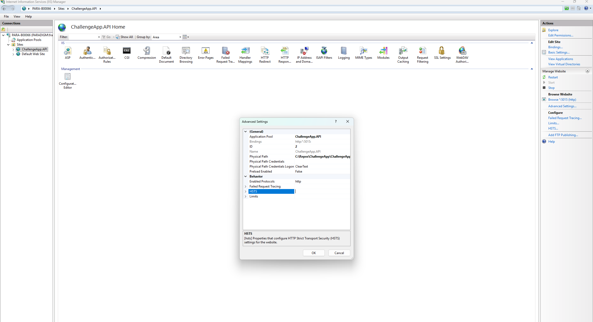](https://github.com/frankrogerrm/ChallengeApp/blob/main/docs/API-IIS-1.png)

- For the creation of the application pool in IIS:

[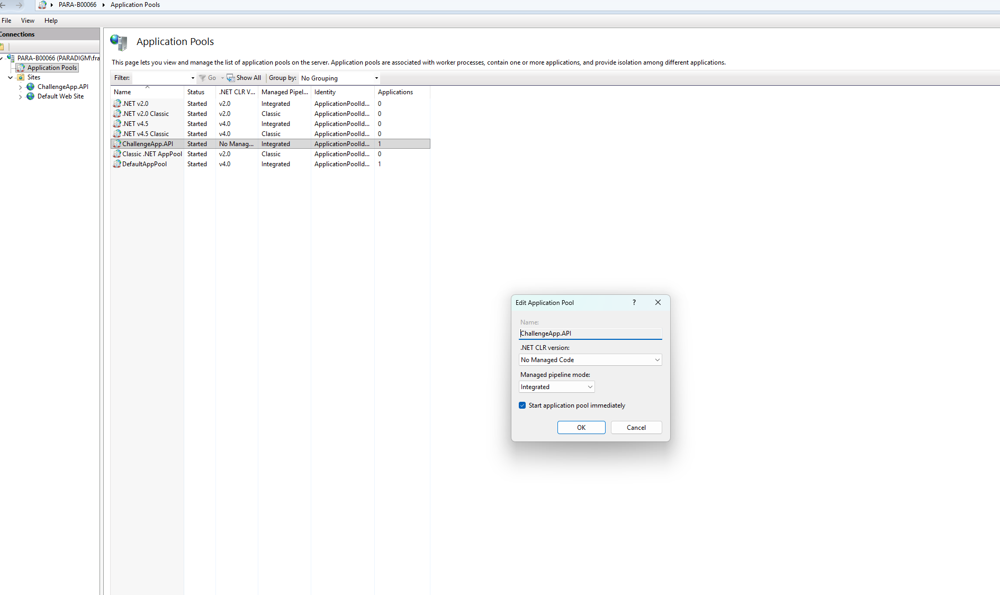](https://github.com/frankrogerrm/ChallengeApp/blob/main/docs/API-IIS-2.PNG)

- Proof the API is running in IIS:

[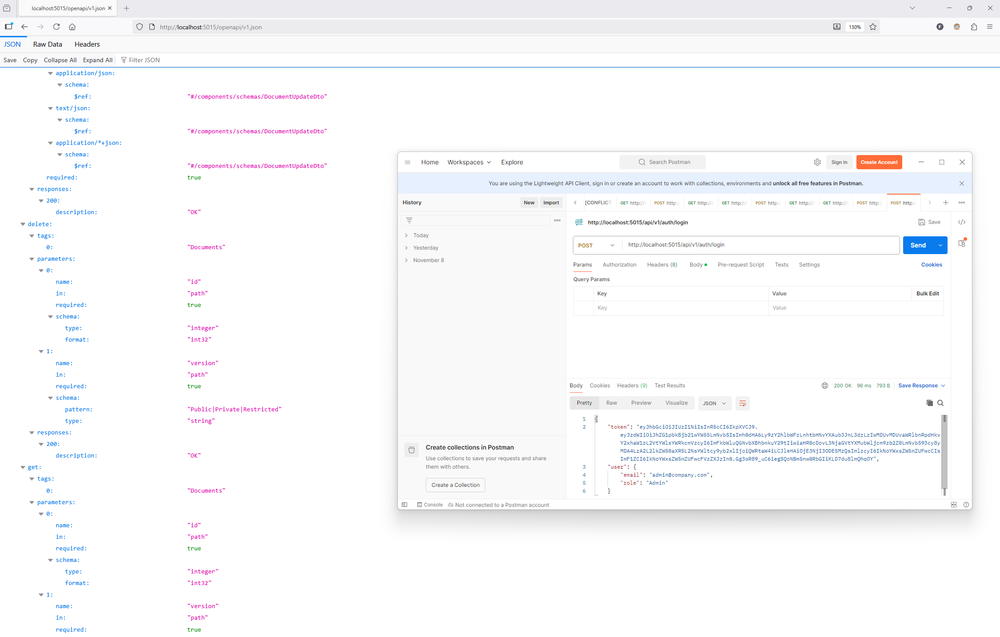](https://github.com/frankrogerrm/ChallengeApp/blob/main/docs/API-IIS-3.png)

### Azure Deployment

#### Proof of UI hosting

Below are screenshots that show the frontend UI running. Each thumbnail links to the full-size image in the repository's `docs/` folder.

- Home / landing and dashboard views:

[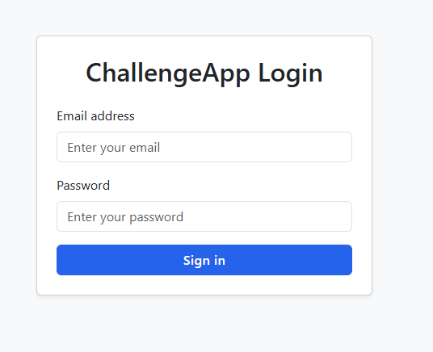](https://github.com/frankrogerrm/ChallengeApp/blob/main/docs/UI-1.png)

- Document list and search:

[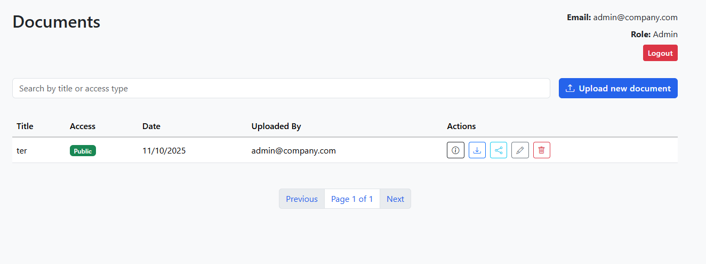](https://github.com/frankrogerrm/ChallengeApp/blob/main/docs/UI-2.png)

- Document upload flow:

[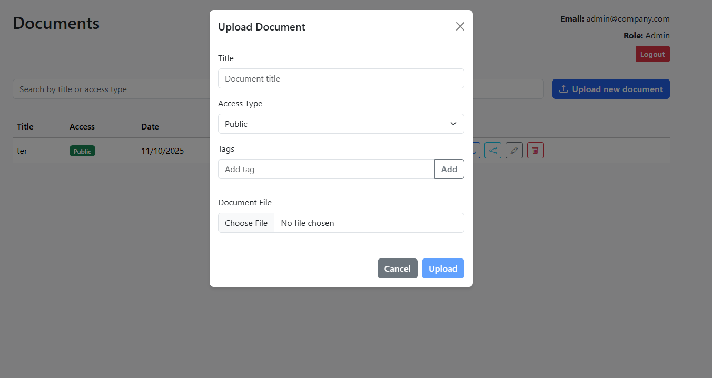](https://github.com/frankrogerrm/ChallengeApp/blob/main/docs/UI-3.png)

- Document detail and preview:

[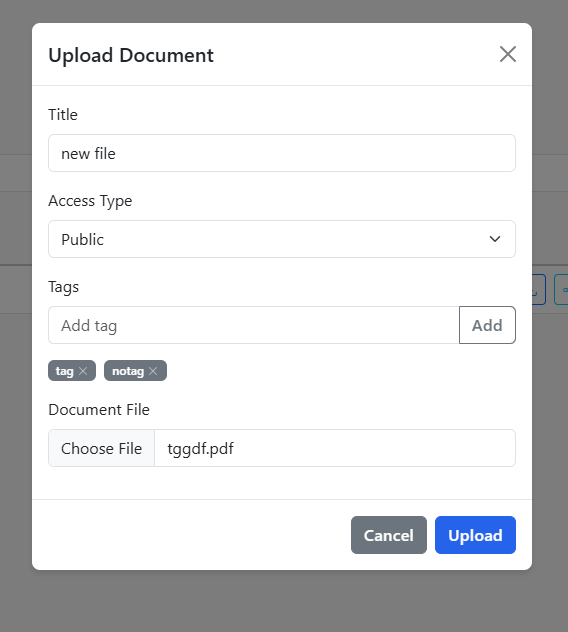](https://github.com/frankrogerrm/ChallengeApp/blob/main/docs/UI-4.png)

- Sharing and permission UI:

[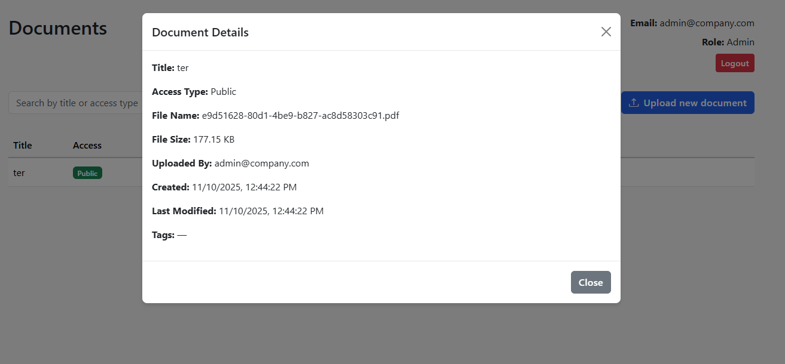](https://github.com/frankrogerrm/ChallengeApp/blob/main/docs/UI-5.png)

- Audit log / activity views:

[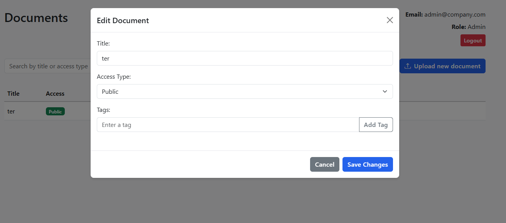](https://github.com/frankrogerrm/ChallengeApp/blob/main/docs/UI-6.png)

- Additional UI state / responsive layout:

[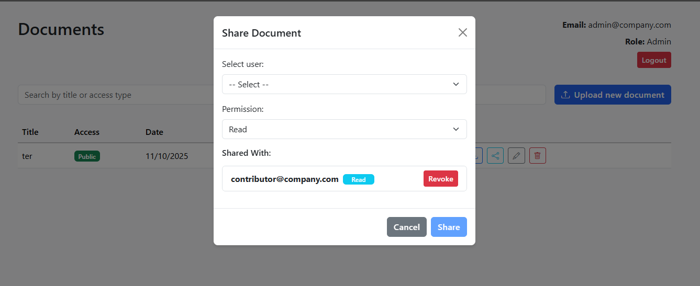](https://github.com/frankrogerrm/ChallengeApp/blob/main/docs/UI-7.png)

1. Create Azure App Service (Windows, .NET 9.0)
2. Create Azure SQL Database
3. Configure connection strings in App Service settings
4. Set up deployment using Azure DevOps or GitHub Actions
5. Configure SSL and custom domain

## Architecture Decisions

### Backend

- Clean architecture with separation of concerns
- Repository pattern for data access
- CQRS-inspired controller actions
- Middleware for error handling and logging
- File storage in protected directory
- Rate limiting for API endpoints

### Frontend

- Next.js for SSR and optimal performance
- TypeScript for type safety
- Axios interceptors for JWT handling
- React context for state management
- Bootstrap for responsive design

## Security Considerations

1. Input Validation
   - File type validation
   - File size limits (10MB)
   - Content-type verification
   - SQL injection prevention via EF Core
2. Authentication & Authorization
   - JWT with 2-hour expiration
   - Role-based access control
   - Resource-level permissions
3. File Security
   - Unique file names
   - Protected storage location
   - Download authorization
4. API Security
   - HTTPS only
   - CORS configuration
   - Rate limiting
   - XSS prevention

## Testing Strategy

### Unit Tests

- Controller logic
- Service layer
- Authorization rules
- File handling

### Integration Tests

- API endpoints
- Database operations
- Authentication flow

### Running Tests

See the Quick Start Guide above for the quick test run instructions (`cd ChallengeApp.Tests` then `dotnet test`).

## Assumptions and Limitations

1. Authentication

   - Mock authentication for demo purposes
   - No user management/registration

2. File Storage

   - Local file system storage
   - Limited file types (PDF, DOCX, TXT)
   - 10MB file size limit

3. Scalability
   - Single server deployment
   - No distributed file storage

## What Could Be Improved

1. Authentication & Authorization

   - Implement proper Identity provider
   - OAuth2/OpenID Connect support
   - MFA support

2. File Storage

   - Cloud storage integration (Azure Blob/S3)
   - CDN integration
   - File versioning

3. Features

   - Document preview
   - Collaborative editing
   - Comment system
   - Workflow automation
   - Email notifications

4. Infrastructure

   - Container support
   - Distributed caching
   - Message queue for background jobs
   - Full text search integration

5. Monitoring
   - Application insights
   - Error tracking
   - Usage analytics
   - Performance monitoring

## System Architecture Diagram

This section describes the logical, layered architecture used across the solution. The design follows standard separation of concerns: Controllers -> Services -> Repositories -> Database, with cross-cutting middleware (logging, error handling, authentication) applied at the API boundary.

Simple text diagram:

```text
[Browser / Client (ChallengeApp.UI)]
               |
         HTTP/HTTPS
               |
   [ChallengeApp.API - Controllers]
               |
        (validation, DTOs)
               |
       [Application Services]
               |
    [Domain / Repositories]
               |
        [Entity Framework Core]
               |
         [SQL Server Database]
```

PlantUML-style (for reviewers who use PlantUML):

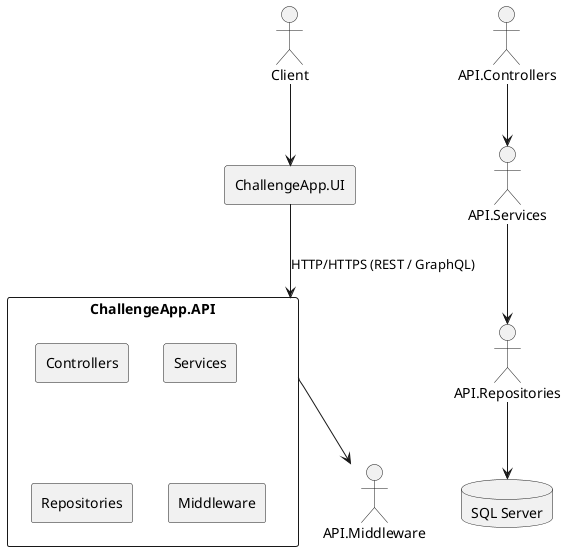

### Architecture contract (brief)

- Inputs: HTTP requests from the UI (JSON or multipart for uploads)
- Outputs: HTTP responses (JSON, file streams)
- Error modes: middleware centralizes error handling and returns consistent error envelopes
- Success criteria: clear separation of business logic in Services; Repositories abstract EF Core access; API surface limited to DTOs

## Database Schema Diagram (ERD)

Below is a concise ERD describing the main entities used by the application.

Entities and important fields:

- Documents

  - Id (PK, int)
  - Title (nvarchar(200))
  - FileName (nvarchar(500))
  - FileSize (bigint)
  - AccessType (nvarchar(50))
  - UploadedBy (nvarchar(100))
  - CreatedDate (datetime2)
  - ModifiedDate (datetime2)

- DocumentTags

  - Id (PK, int)
  - DocumentId (FK -> Documents.Id)
  - Name (nvarchar(50))

- DocumentShares

  - Id (PK, int)
  - DocumentId (FK -> Documents.Id)
  - SharedWithUserEmail (nvarchar(100))
  - Permission (nvarchar(50))
  - CreatedBy (nvarchar(100))
  - CreatedDate (datetime2)

- AuditLogs
  - Id (PK, int)
  - UserEmail (nvarchar(100))
  - Action (nvarchar(100))
  - Entity (nvarchar(50))
  - Timestamp (datetime2)
  - IpAddress (nvarchar(50))

Relationships

- Documents 1 --- \* DocumentTags (one document can have many tags)
- Documents 1 --- \* DocumentShares (one document can be shared with many users / records)
- AuditLogs \* --- 1 (logs reference entities by name/id; optionally FK relationship can exist for strongly-typed audits)

ASCII ERD (simple):

```text
Documents (1) ------ (N) DocumentTags
Documents (1) ------ (N) DocumentShares
AuditLogs (N) ------ (1) Entities (identified by Entity + Id)
```

Notes:

- The schema favors normalization for tags and shares, while AuditLogs are append-only and optimized for write throughput. If you want stronger referential audit links, add nullable foreign keys to Documents in AuditLogs where appropriate.

## API Architecture Overview

The API is organized using well-known patterns to promote maintainability and testability.

- Controllers: lightweight adapters that accept HTTP requests, validate input (ModelState and additional validators), map DTOs to application inputs, and return HTTP responses. Controllers do not contain business logic.
- Services (Application Layer): contain business rules and orchestration. Services are injected into controllers via DI. They perform validation beyond syntactic checks, coordinate repository calls, and publish domain events or audit entries.
- Repositories (Data Access Layer): encapsulate EF Core DbContext usage and expose coarse-grained methods (GetDocumentById, AddDocument, SearchDocuments, etc.). Repositories return domain entities or DTO-shaped projections when performance matters.
- DTOs: Data Transfer Objects are used for request/response shapes. Mapping is handled via a mapping layer (AutoMapper or manual mapping) to decouple domain entities from API contracts.
- Middleware: centralized cross-cutting concerns (ErrorHandlingMiddleware, LoggingMiddleware, Authentication/Authorization middleware, RequestSizeLimit, CORS, RateLimiting).

Request flow (summary):

1. HTTP request enters API and passes through middleware (CORS, TLS termination, rate limiting, auth).
2. Authentication middleware validates JWT and sets HttpContext.User.
3. Request reaches Controller; Model binding and ModelState validation occur.
4. Controller maps DTO to service input and calls the corresponding service.
5. Service applies business logic and calls Repositories as needed.
6. Repositories use EF Core to query or persist data.
7. Service returns result; Controller maps to response DTO and returns HTTP response.

## Security Document

This section expands on security controls implemented and recommended for the system.

1. Input validation

   - Use ModelState and DataAnnotation validators for basic rules.
   - Apply explicit server-side validation for all business-critical inputs (length, type, ranges).
   - Use a validation pipeline (FluentValidation recommended) to centralize rules and produce consistent error messages.

2. File upload restrictions

   - Allowed content types: application/pdf, application/msword, application/vnd.openxmlformats-officedocument.wordprocessingml.document, text/plain. Configure server-side MIME checks.
   - Maximum file size: 10 MB (enforced at middleware and controller level). Consider server configuration (Kestrel limits) to match.
   - Sanitize file names and store files with GUID-based names; never rely on client-supplied filenames for storage paths.
   - Scan uploaded files with an antivirus engine (ClamAV or cloud provider scanning) for production deployments.

3. Authentication and JWT

   - The API issues JWT tokens using a secret configured in `appsettings.json` under `Jwt:Secret`. In production use a secure secret stored in a vault or environment variable.
   - Token lifetime: short-lived (configured in Jwt settings, example: 2 hours). Support refresh tokens or silent re-auth where required.
   - Validate tokens with built-in ASP.NET Core JWT middleware (issuer, audience, signing key, expiry).
   - Use HTTPS in all environments exposing the API.

4. Authorization & Role-based access

   - Use role-based claims (e.g., Admin, Contributor, Manager, Viewer) enforced via [Authorize(Roles = "...")] attributes or policy-based authorization for resource checks.
   - For resource-level permissions (DocumentShares), perform explicit checks in services to confirm the requesting user has the required permission for the target resource.

5. CORS and XSS protection

   - Configure CORS to restrict allowed origins to the frontend domain(s) used in staging/production and avoid open wildcards.
   - Sanitize user inputs that are rendered by the UI. The backend returns only minimal HTML-free JSON; all rendering sanitization should be applied in the UI layer when applicable.

6. Rate limiting and abuse mitigation

   - Apply rate limiting middleware at the API gateway or ASP.NET middleware level to limit brute-force and DOS-like behaviors.
   - Log and alert on suspicious patterns (e.g., many failed auth attempts, repeated file upload errors).

7. Audit logging

   - All sensitive operations (logins, document downloads, document shares, deletes) write to an append-only AuditLogs table with user, action, entity and timestamp.
   - Do not store secrets or raw passwords in logs.

8. Transport and secrets
   - Always use TLS (HTTPS). Configure and renew certificates via a managed solution (Let's Encrypt, Azure App Service certs, etc.).
   - Store sensitive configuration (DB connection strings, JWT secrets) in environment variables or secure key vaults.

## Mock Auth Usage Explanation

The project includes a mock authentication setup intended for development and integration tests. Key points:

- User store: a simple in-memory collection (or seeded database) containing mock users with email, role and password for development convenience.
- Token issuance: the `AuthController` (or equivalent service) validates credentials against the mock store and issues a JWT using the configured `Jwt:Secret`. The token contains standard claims (sub, exp, iat) and role claims (e.g., `role: Admin`).
- Token validation: ASP.NET Core's JWT middleware validates incoming tokens (signature, issuer, audience, expiration). Valid tokens populate `HttpContext.User` with claims accessible across controllers and services.
- Claims mapping and enforcement: role claims are mapped automatically by the JWT middleware and can be enforced via `[Authorize(Roles = "Admin")]` attributes or policy-based checks. For resource-level permissions, services extract user identity from `HttpContext.User` and apply explicit checks against `DocumentShares` or owner fields.

Security note: The mock auth is for local development and tests only. Replace it with a production-grade identity provider (IdentityServer, Azure AD, Auth0, etc.) before deploying to production.

## Code Comments and Documentation

Key areas of the codebase follow clean-code and documentation guidelines:

- Middleware: central middleware components (error handling, logging, authentication) include XML comments and inline explanations of expected behavior and configuration knobs.
- Services: public service APIs have XML documentation where appropriate; complex business flows contain inline comments explaining decisions and non-obvious logic.
- DTOs and Models: DTO types include short summaries and property-level comments to explain validation and business expectations.
- Tests: unit and integration tests include clear Arrange/Act/Assert structure and document the scenario being covered.

This approach improves onboarding and code review for future maintainers.

## .gitignore and Commit History

- A `.gitignore` file is present in the repository and excludes build artifacts, user-specific IDE files, node_modules, published output, and other workspace-specific items. Typical entries include `bin/`, `obj/`, `node_modules/`, `.vs/`, `*.user`, `appsettings.Development.json` (if you prefer to keep secrets out of the repository), and `*.db` for local databases when used.
- The repository's Git history follows descriptive commit messages. Commits should be scoped and include the reason for the change, e.g., `API: Add document sharing service and tests` or `UI: Fix upload edge-case and sanitize filename`.

If you would like, I can also add a short CONTRIBUTING.md that documents commit message style (conventional commits or another schema), branching strategy, and release tagging guidelines.

---

If you'd like these new sections adjusted (for example: including exact relative paths to `ChallengeAppDb-script.sql` and `ChallengeAppDb.bak`, or adding PlantUML diagrams as separate `.puml` files), tell me which variant you prefer and I will update the README and/or add the additional files.
